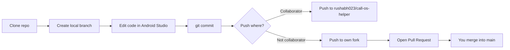

# GitHub overview — Call OS Helper

How this project is hosted, shared, and worked on.

---

## Repository

| Item | Value |
|------|--------|
| **Name** | `call-os-helper` |
| **Owner** | `rushabh023` |
| **Visibility** | **Public** — anyone with the link can view and clone |
| **Web URL** | https://github.com/rushabh023/call-os-helper |
| **Clone URL** | https://github.com/rushabh023/call-os-helper.git |

---

## How the code is distributed

```
GitHub (cloud)
    │
    ├── main                    ← default / stable branch
    │
    └── rushabh-call-os-helper  ← separate working branch (same code at start)
            │
            ▼
    Developer clones to PC  →  Android Studio  →  APK on phone
```

1. **Source of truth** — All project files live on GitHub (not only on one laptop).
2. **Public read** — Anyone can open the link, browse files, or clone without your password.
3. **Write access** — Only you (owner) and **collaborators** you invite can push directly to this repo.
4. **Others’ changes** — They usually work on a **fork** or a **local branch**, then open a **Pull Request** if you want their code merged.

---

## Branches

| Branch | Purpose |
|--------|---------|
| `main` | Default branch. Use for stable, shared code. |
| `rushabh-call-os-helper` | Separate branch for experiments or Rushabh-specific work. |

**View a branch on GitHub:**  
`https://github.com/rushabh023/call-os-helper/tree/<branch-name>`

Example:  
https://github.com/rushabh023/call-os-helper/tree/rushabh-call-os-helper

---

## Ways to get the code

### 1. Share the link (simplest)

Send:

```
https://github.com/rushabh023/call-os-helper
```

No GitHub account required to **view** or **download ZIP** (Code → Download ZIP).

### 2. Clone with Git (for development)

**Default branch (`main`):**

```bash
git clone https://github.com/rushabh023/call-os-helper.git
cd call-os-helper
```

**Specific branch:**

```bash
git clone -b rushabh-call-os-helper https://github.com/rushabh023/call-os-helper.git
```

### 3. Fork (on someone else’s GitHub)

They click **Fork** on GitHub → get `their-username/call-os-helper` → clone their copy → push to their fork.

---

## Typical workflow



**You (owner):**

```bash
git checkout rushabh-call-os-helper   # or main
# ... make changes ...
git add .
git commit -m "Describe your change"
git push origin rushabh-call-os-helper
```

**Someone else (not a collaborator):**

```bash
git clone https://github.com/rushabh023/call-os-helper.git
git checkout -b teammate-feature
# ... changes ...
git push origin teammate-feature   # only works if they forked first
```

---

## What is in the repo vs only on your PC

| In GitHub repo | Not in repo (local only) |
|----------------|---------------------------|
| Kotlin / Compose source | `local.properties` (Android SDK path) |
| `gradle/`, `gradlew`, manifests | `app/build/` outputs |
| `README.md`, this file | Signing keys (release) |
| `.gitignore` rules | IDE-specific cache (ignored) |

After clone, open the folder in **Android Studio** — it creates `local.properties` automatically.

---

## Build after clone

```bash
cd call-os-helper
./gradlew assembleDebug
```

Windows:

```powershell
.\gradlew.bat assembleDebug
```

Debug APK path:

```
app/build/outputs/apk/debug/app-debug.apk
```

---

## Permissions summary

| Action | Public visitor | Collaborator | Owner (you) |
|--------|----------------|--------------|-------------|
| View code | Yes | Yes | Yes |
| Clone / download | Yes | Yes | Yes |
| Push to your repo | No | Yes | Yes |
| Change repo settings | No | No | Yes |
| Make repo private | No | No | Yes |

**Add a collaborator:** Repo → **Settings** → **Collaborators** → **Add people**.

---

## Related apps (not in this repo)

| App | Package | Role |
|-----|---------|------|
| **Call OS Helper** (this repo) | `com.example.helper_application` | Permissions, call detection, signals main app |
| **Mes Validation** (separate project) | `com.mesvalidation` | Records and saves calls (must implement receiver) |

Recordings folder (both apps should use):

```
Internal storage/Documents/MesValidationCallRecorder
```

---

## Quick message to share with a teammate

> **Call OS Helper** — Android companion for call recording setup.  
> Repo: https://github.com/rushabh023/call-os-helper  
> Clone: `git clone https://github.com/rushabh023/call-os-helper.git`  
> Branch (optional): `rushabh-call-os-helper`  
> Open in Android Studio, run `gradlew assembleDebug`.  
> Needs Mes Validation app (`com.mesvalidation`) for full recording flow.  
> Logs: Logcat filter `HelperApplication`.

---

## History note

This repo was first published as `mes-validation-helper`, then renamed to **`call-os-helper`**. Old links may redirect to the new name.
