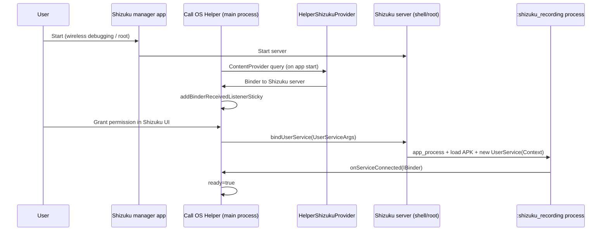

# Shizuku integration guide (Call OS Helper)

This document follows the **official** sources:

- [Shizuku user manual](https://shizuku.rikka.app/guide/setup.html)
- [Shizuku-API README](https://github.com/RikkaApps/Shizuku-API/blob/master/README.md)
- [Shizuku-API demo](https://github.com/RikkaApps/Shizuku-API/tree/master/demo) (`DemoActivity`, `UserService`)

Your app uses **UserService** (privileged subprocess) for call recording — not just `checkSelfPermission()`.

---

## Two layers (do not confuse them)

| Layer | What it means | Your log fields |
|-------|----------------|-----------------|
| **1. Shizuku manager** | Shizuku app running, ADB/root server up | `binderPing=true`, `shizukuUid=2000` (ADB) or `0` (root) |
| **2. App permission** | User allowed *your package* in Shizuku | `permission=true` |
| **3. User service** | Shizuku spawned `yourapp:shizuku_recording` and returned a binder | `serviceConnected=true`, `ready=true` |

Layers 1–2 can be OK while layer 3 fails (your current situation). **`ready=false` does not mean Shizuku is broken** — it means the recording subprocess never connected.

---

## End-to-end connection flow



---

## Step 1 — Dependencies (Gradle)

```kotlin
implementation("dev.rikka.shizuku:api:13.1.5")
implementation("dev.rikka.shizuku:provider:13.1.5")
```

Same major version for `api` and `provider`.

---

## Step 2 — AndroidManifest (required)

From [Shizuku-API README](https://github.com/RikkaApps/Shizuku-API/blob/master/README.md):

```xml
<uses-permission android:name="moe.shizuku.manager.permission.API_V23" />

<application>
    <meta-data
        android:name="moe.shizuku.client.V3_SUPPORT"
        android:value="true" />

    <provider
        android:name=".shizuku.HelperShizukuProvider"
        android:authorities="${applicationId}.shizuku"
        android:enabled="true"
        android:exported="true"
        android:multiprocess="false"
        android:permission="android.permission.INTERACT_ACROSS_USERS_FULL" />
</application>
```

- **Authority** must be exactly `${applicationId}.shizuku`.
- **INTERACT_ACROSS_USERS_FULL** on the provider protects it from random apps.
- **V3_SUPPORT** helps Shizuku manager list your app correctly.

**Queries** (Android 11+): declare Shizuku packages if you check installation:

```xml
<package android:name="moe.shizuku.privileged.api" />
```

---

## Step 3 — Acquire the Shizuku binder

Shizuku delivers the binder via `ShizukuProvider` when your app process starts. You must listen for binder lifecycle:

```kotlin
Shizuku.addBinderReceivedListenerSticky { /* binder alive */ }
Shizuku.addBinderDeadListener { /* Shizuku stopped — reset state */ }
```

Use **sticky** listener (official demo does). If you only use `addBinderReceivedListener`, you can **miss** the event when the binder was already available before the listener was registered.

Check binder:

```kotlin
Shizuku.pingBinder()  // true = can call Shizuku APIs
```

---

## Step 4 — Request permission (like runtime permission)

From API v11+, same pattern as `requestPermissions`:

```kotlin
if (Shizuku.isPreV11()) { /* unsupported */ }

when (Shizuku.checkSelfPermission()) {
    PackageManager.PERMISSION_GRANTED -> { /* proceed */ }
    else -> Shizuku.requestPermission(REQUEST_CODE)
}

Shizuku.addRequestPermissionResultListener { requestCode, grantResult ->
    if (grantResult == PERMISSION_GRANTED) bindUserService()
}
```

**User action:** Shizuku manager app → your app → allow.

---

## Step 5 — UserService (privileged recording process)

This is what Call OS Helper uses for `VOICE_CALL` / shell-level `MediaRecorder`.

### 5a. AIDL interface

Service class extends generated `Stub`. Must include fixed destroy transaction:

```aidl
void destroy() = 16777114;
```

### 5b. Service class (Java recommended)

Official demo: [UserService.java](https://github.com/RikkaApps/Shizuku-API/blob/master/demo/src/main/java/rikka/shizuku/demo/service/UserService.java)

Requirements:

- Class name stable (ProGuard keep rules).
- **`@Keep` constructors:** no-arg and `UserService(Context context)` (Shizuku v13+ prefers `Context`).
- Implement `destroy()` → cleanup → `System.exit(0)`.
- **Do not** run full `Application.onCreate()` logic in the user-service process (no second `bindUserService`, no UI/storage init). See `HelperApplication` + `ShizukuProcess` in this repo.

### 5c. Bind from main process only

```kotlin
val args = Shizuku.UserServiceArgs(
    ComponentName(packageName, "…ShizukuRecordingUserService")
)
    .tag("mes_validation_recording")      // stable id; optional but recommended
    .version(1)                           // bump only when you must kill old process
    .daemon(false)                        // demo uses false; try true only if needed
    .debuggable(false)                    // true breaks subprocess on many Samsung builds
    .processNameSuffix("shizuku_recording") // REQUIRED non-null suffix

Shizuku.bindUserService(args, serviceConnection)
```

`ServiceConnection.onServiceConnected` → `IShizukuRecordingService.Stub.asInterface(binder)`.

### 5d. Android Studio debug install

Official README:

> **Run → Always install with package manager** must be enabled.

Without this, Shizuku often cannot load the latest APK in the user-service process.

### 5e. Unbind / stop

```kotlin
Shizuku.unbindUserService(args, connection, remove = true)
```

Process does **not** exit until your service `destroy()` runs.

---

## Step 6 — Timing on OEM devices (Samsung, etc.)

Known issues from [Shizuku #451](https://github.com/RikkaApps/Shizuku/issues/451) and [#1171](https://github.com/RikkaApps/Shizuku/issues/1171):

| Issue | Mitigation |
|-------|------------|
| `provider is null` when binding too early | Wait **1.5–2.5 s** after app open before first `bindUserService`; revoke + re-grant in Shizuku app |
| Heavy `Application.onCreate` in user process | Minimal init in `:shizuku_recording` |
| Heavy `ShizukuProvider.onCreate` | Lightweight `HelperShizukuProvider` |
| Shizuku killed in background | Unrestricted battery for **Shizuku** and **Helper** |

---

## Step 7 — User / device setup (Shizuku app)

From [shizuku.rikka.app/guide/setup](https://shizuku.rikka.app/guide/setup.html):

1. Enable **Developer options** + **USB debugging** (or **Wireless debugging** on Android 11+).
2. Install **Shizuku** (`moe.shizuku.privileged.api`).
3. Start Shizuku (wireless pairing or `adb shell sh …/start.sh`).
4. Allow Shizuku **background / unrestricted** battery.
5. Android 11+: enable **Disable adb authorization timeout**.
6. Open Call OS Helper → grant Shizuku permission → wait for **Ready** or use **RETRY SHIZUKU CONNECTION**.

Samsung / Realme: if user service never starts, check unfiltered Logcat for tag **`ShizukuServiceStarter`**.

---

## How this repo maps to the guide

| Official piece | Our implementation |
|----------------|-------------------|
| `ShizukuProvider` | `HelperShizukuProvider` |
| Binder listeners | `ShizukuManager.init()` — sticky received + dead + permission |
| Permission | `ShizukuManager.requestPermission()` / `hasPermission()` |
| UserService | `ShizukuRecordingUserService.java` |
| AIDL | `IShizukuRecordingService.aidl` |
| Bind orchestration | `ShizukuManager.bindUserServiceIfNeeded()` |
| Recording engine | `ShizukuRecordingEngine` ← `CallRecorder` ladder |
| UI | Dashboard Shizuku section + retry |

---

## Success checklist (Logcat tag `HelperApplication`)

```
[Shizuku] Binder received from Shizuku manager
[Shizuku] call#- | permission_result | granted=true
[Shizuku] call#- | bind_requested | component=…ShizukuRecordingUserService …
[Shizuku] user_service_created | ctor=context pid=…
[Shizuku] call#- | user_service_connected | binderAlive=true recordingInterface=true
[Shizuku] call#- | init | ready=true readinessReason=ready
```

---

## If layer 3 never works on a device

Shizuku **permission + binder** can work while the OEM blocks `app_process` user services. Fallback in this app:

- MediaRecorder AMR (your voice)
- Speaker boost
- Optional MediaProjection dual WAV

Do not block the whole app on `ready=false`; treat Shizuku as **optional enhancement** for two-way GSM.

---

## References

- Setup: https://shizuku.rikka.app/guide/setup.html  
- API: https://github.com/RikkaApps/Shizuku-API  
- Demo bind: `DemoActivity.java` → `bindUserService()`  
- ACR-style helper: https://github.com/NLLAPPS/ACRPhoneHelper  
